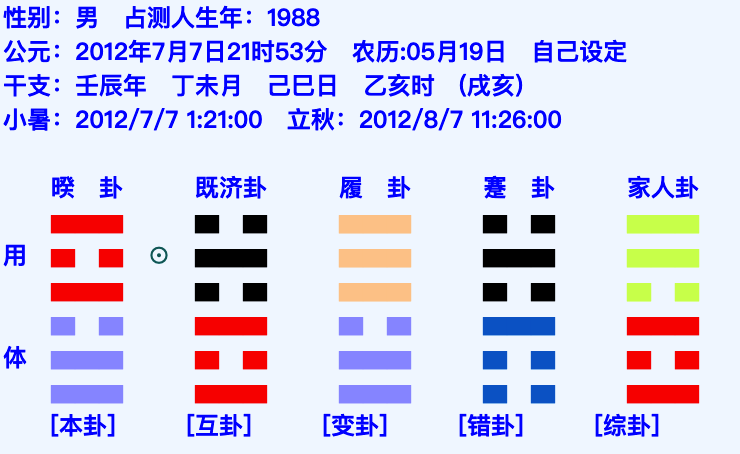
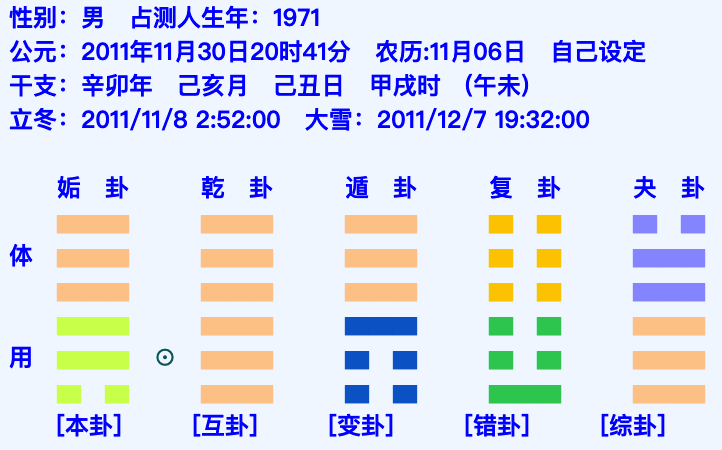
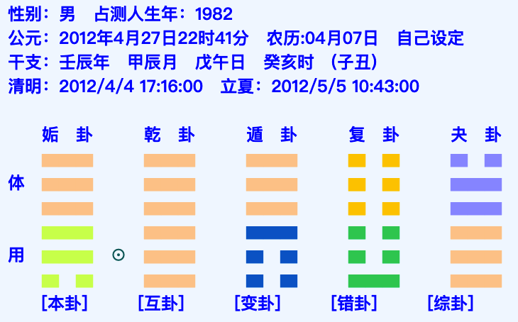

# 基础知识

## 八卦万物类象

### 乾卦

### 坤卦

# 起卦方法

报数起卦

时间起卦

人物+后天八卦方位

# 各种卦

本卦，互卦，变卦，错卦，综卦

其中错卦和综卦可以是本卦的，也可以是互卦和变卦的错卦和综卦

本卦，互卦，变卦看不到象意就看错卦和综卦

**64卦名（被口诀）**

# 断卦

## 天地定位

天水垢  金生水，上生下

## 断卦原则

男比肩易破财（冒险性投资），抢夺钱财，易离婚，晚婚；

女比肩乱夫，2个巽卦，老公不知道选哪个

**断数字，比肩是加法**

有比劫先找比劫，没有比劫找生，无生再找克

一个卦有比劫，看婚姻婚姻有问题，看财运财运有问题，特别是往外生的天地定位，测考试代表竞争对手竞争很激烈，80%不喜欢比劫，20%比劫有制（震震变为兑震，金克木，比肩有制）

## 断感情

1：首先看是否异性

2：符合天地定位，男在外，女在内，不符合的话，阴阳对调，婚姻不会很幸福

3：岁差相差不隔2个等级，比如乾卦不能和兑卦，年龄相差太大

4：卦象

**好婚姻标准：一个等级，相生的为好，男的克女的可以，但不能女的克男的**

乾卦宜配坤卦，次配离卦，不能配兑（超过2个等级，离婚），巽（金木相冲必争吵）

震卦宜配离卦（木生火），次配巽卦（一个等级，婚姻比较晚），配兑（震兑相冲）离婚，坤不幸福（娶老母）

坎配离是正配，坎配兑也可以（相生），坎配巽婚姻最凶（巽为证书，坎为病，证书有问题，有离婚之象），配坤婚姻有病一般般（女克男女当家）

艮配兑是正配，艮配离也可以（火生土），艮配巽婚姻有险（证书被止，证书在坟墓，女克男，天地定位错），艮配坤必离婚（艮坤相冲）

主卦和变卦都好的最好，如果有其中一卦好的，也还可以

**典型的婚姻不好的卦：雷泽归妹，天风姤，山地剥，水风井，山风观（证书止），泽风大过（缺证书），风火家人（证书投火），天泽履（岁差超过2个等级），乾乾，艮艮，震震，巽巽，兑兑，离离，坎坎，坤坤这几个相同的也容易离婚（因为比肩）**

乾卦和艮卦都主孤独

婚姻可以不看体用，先看卦象

### 案例

网名 九吉祥  九是主卦乾卦，吉是互卦，祥是变卦，如果是九详，那就忽略互卦，如果只是九，那即是主卦也是变卦

所以看到这个网名，就断这个人离婚了

类似的金元宝，金是乾卦，元宝也是乾卦，或者元是乾卦，宝是艮卦，都代表独身

网名：一梅，就是乾卦+巽卦或者乾卦+震卦，断离婚了

# 天干地支

## 十二支配人体

子为耳，丑未胞肚，寅为手，卯为指，辰为肩、胸，巳为面、咽齿，午为眼，未为脊梁，申为经络，酉为精血，戊为命门、腿足，亥为头

## 十二支配脏腑

寅为胆，卯为肝，巳为心，午为小肠，辰戌为胃，丑未为脾，申为大肠，酉为肺，亥为肾，子为膀胱

## 十天干配脏腑

甲肝乙胆丙小肠，丁心

## 地支六冲

断逢冲必动必换，工作有变动，关系散了

## 地支六合（断某人跟某人是否暗中有联系）

子丑合化土，寅亥合化木

卯戌合化火，辰酉合化金

巳申合化水，午未合化土

**有时候断谈恋爱应期，合作应期**

## 地支六刑

子卯相刑（不利婚姻），寅刑巳、巳刑申、**申刑寅**（车祸，刀灾）

自刑（自己跟自己过不去，自己不放过自己，手瘾，自杀倾向）

# 体用关系

体卦：代表自己（没有动爻）

用卦：客观事物

主卦：代表事物的开始或者主题

互卦：代表事物的中间过程，揭隐私

变卦：代表事物的结局

六神：青龙（甲乙），朱雀（丙丁，离卦受冲有官司口舌），勾陈（己），腾蛇（巽卦，己），白虎（庚辛，逢冲有意外之伤），玄武（壬葵，小偷），

## 干支化卦

甲寅化震卦，乙卯化巽卦

丙午化离卦，丁巳化离卦

戊辰戌化艮卦，己丑未化坤卦

庚申化乾卦，辛酉化兑卦

壬子化坎卦，癸亥化坎卦

**旺衰论，阴阳变化**

# 定太极

求测人：中年女人离卦，然后看离卦在这个梅花卦中的位置，来判断太极点跟别的关系及吉凶

## 案例1

### **断学历（23岁）**

互卦证书被克，变卦是楼叠楼

艮卦 代表专

震卦，巽卦为证书，证书不能被伤，伤了就证书不给力

如果没有震，巽，那就看离和坤

**断大专，以后专升本**

### 断兄弟姐妹

兄弟姐妹先看先天卦（主卦），有比先找比

起卦为离，代表自己

本卦艮代表少男，有个弟弟，**如果本卦的下卦是巽，断有个妹妹（不能断姐姐，因为体卦为天卦为大）**

### **断学的专业**

机电专业

### **断职业**

本卦有电子厂的象意

### **断工资收入**

变卦比肩工资低，先看他年龄23岁，大专毕业也就1-2年，经验少，如果本卦是3700，互卦是2500，考虑到工资少，直接读互卦的数就行

### **断婚姻**

先看比肩，婚姻比较晚，主卦，火生土，癸巳年，水冲体卦，逢冲必动，可能冲动破处，有女朋友，可以在本卦定艮卦为我，代表有个中年女找上他。什么时候破处呢。火旺用水冲，不见得冲得动，火弱才能被冲动，原卦找是否有水或者土来泄火，只有艮卦，那就辰月泄火，不能未土（因为夏季火旺）所以2013年辰月结束了处男生涯

**不能为丑月，因为辰才化艮卦，丑不能化艮卦**

一开始好，慢慢不好，变卦为比肩，最后肯定是要分手的

## 案例2

### **断学历**（24岁）

#### 断学历技巧

巽木，震木主证书主教育，一般学历较高，但不能受克，最好受生

离卦主文化，如果和震卦巽卦配合，一般高学历，离卦与兑卦配合，学历低（缺学历），离卦总体学历高

坎卦看配合，配合好本科，研究生，博士生，配合不好就高中，坎卦求静

艮卦一般主大专，中转

坤主场地，校园（配合好大学，配合不好大专，高中）

金主动，不能安心学习，乾兑一般学历不高

坎（文昌理科，一般主智慧，一般有大专学历，）和巽（文曲星，文科，但不能被伤）

**结合年代：60年代生人高中学历为高，70年代生人中专大专为高，80年代以后本科为高**

------

本卦，缺文化，互卦 水火相冲

**断学历不高，小学初中**

本卦：小学，初中、互卦：高总、变卦：大学，这种顺序来看

### **断婚姻感情**

本卦同性，变卦老夫配少女，所以断没有结婚，互卦倒是正常男女配

因为互卦揭隐私，所以有女朋友，变卦不能结婚，最终结果会分手

### **断兄弟姐妹**

一般先看先天本卦，可以直接读我上面有个姐姐

从太极点来看（先看本卦和变卦，最后看互卦），因为是男，24岁，最好是坎卦，但没有坎卦，所以找艮震，也没有，那就只能用乾卦代替，所以变卦看有个妹妹

本卦和变卦有冲突，所以看互卦，坎卦为中年男，下卦也代表妹妹

再结合太极点乾卦为天为大

所以综合来看，是有个妹妹

### 断城市还是农村

主卦直读，缺热闹，在农村，现在经常在走动，流动性很大，城里的房子120平（互卦数不对，看变卦）艮卦可以看以前的房子，卦不明，看错综，错卦断房子后面有水或者马路，上卦为后，下卦为钱，西边缺房子（以错卦为太极点看东南西北）

## 案例3

### 断学历（40岁）

巽被克，金旺主动，学习不好，学历低，最多初中

### 断兄弟姐妹

本卦和变卦没比劫，那先天本卦有个妹妹，但巽卦很弱，被主卦和互卦金克，可能保不住，太极点也有个妹妹

本卦代表有5个，有一个入墓（艮为墓）

### 断子孙

本卦先生女孩，变卦后生男孩

### 断最近状态

断经常做梦，睡眠质量不好，经常失眠（本卦金克木伤）

身上浑身僵硬

你想清静清静（变卦，圆的庙宇，房子，有出家之象）

本卦金克木为财，做贸易（做调味品的代理商），变卦土来生金，**辛卯年又金旺木旺，所以身旺财旺**

### 断疾病

过强过弱都为病

金旺木弱，肝胆有毛病（因为做生意，经常喝酒，肝胆一般会有问题），土也比较弱，主脾胃有毛病

### 断老婆及婚姻

乾卦为他，巽为他老婆，巽为风，艮为房间，卦不明看错综，错卦地雷覆（和众人在动打麻将），是否赢，因为坤为口袋，经常动口袋，且变卦土生金，往外生，破财之象，很明显是经常输。

天山遁也有房子里只有1个人的象意，说明老婆往外跑，去打麻将了，本身本卦，乾卦冲巽卦，婚姻不好，因为老婆经常出去打麻将的事吵架。

### 断儿子，父亲

艮为小孩子，为专，但土生金，往外生，就是往外跑，所以学习也不会太好

在变卦同时艮卦生乾卦为母亲，艮为坟墓，因为在变卦，所以父母现在健在

辛卯年，庚为退气太岁，本卦的乾卦为乾，巽为农村，所以10年当过农村的一把手

## 案例4

### 断学历（31岁）

学历跟上例差不多，最多高中，中专

### 断兄弟姐妹

本卦，乾卦克巽卦，巽卦取长女，因为82年的不可能生5个（跟上例的区别），

太极点：31岁应该用坎卦，坎卦没有用艮卦，那就说明有他和姐姐2人

### 断职业

什么代表他，体卦乾卦代表他，变卦艮也代表他，土生金，往外生，会不是是公务员，不是，学历不够，会不会是老板？不会，因为艮卦为手指体力，往外跑，干的是体力活，干的什么体力活？本卦巽为风，变卦，在机械厂的流水线上的作业

### 断婚姻

晚婚，至少以前有女朋友，或者现在有，但关系不好，身旺财旺，才能得到财（得到女朋友），12年壬辰年，辰为艮土，艮土生乾金，金旺，但后面要分手。壬水为坎水，乾生坎水再生巽木，身旺财旺，所以12年交的女朋友，水也是食伤，也代表性，代表欲望，所以也旁证了这一年交了女朋友

因为经济问题发生争吵，房租也交不起，变卦艮有房子的意思，往外生，往外出钱，所以2人感情不好主要是因为房租问题

### 断姐夫职业

姐夫为乾卦，是一把手，是家里老大

